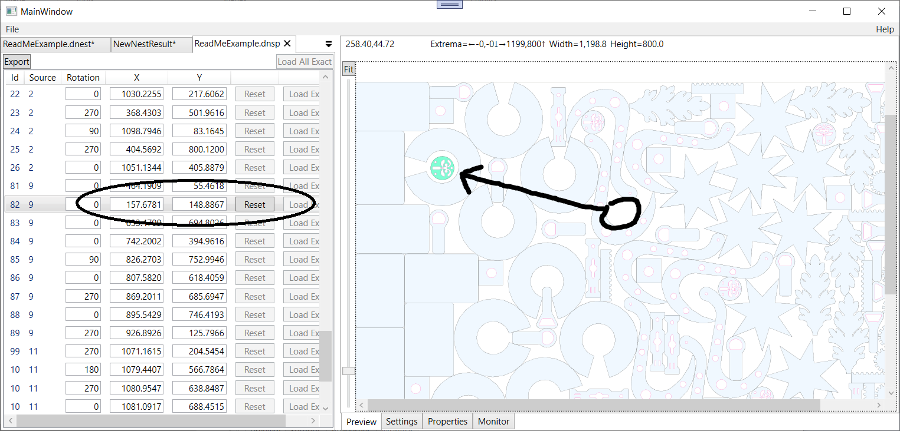
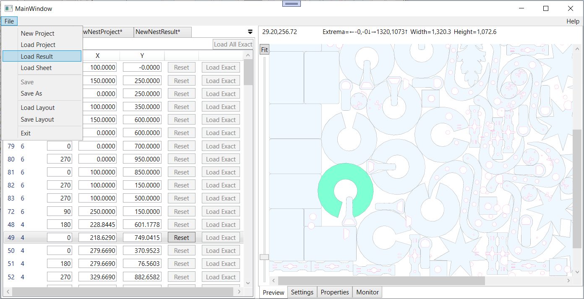

# DeepNestSharp
DeepNest - The Original (https://github.com/Jack000/Deepnest)<br />
DeepNestPort - C# port (https://github.com/fel88/DeepNestPort)

**"If I have seen further, it is by standing upon the shoulders of giants"**<br />
Jack and Felix have done some great work but the originals use of a remote service
to translate between image formats was an issue and the Port just wasn't proving stable 
enough for my needs. I really needed the ability to save projects, nest 
results and individual sheet placements, the ability to seed subsequent nests with 
the results of prior nests and the ability to edit placements - to slip that 
last piece in to the gaps on the sheet that the algorithym just wasn't finding.

Felix was keen to keep true to the original DeepNest code in DeepNestPort...
> > [Hope you consider breaking away from the legacy code base because it's getting really hard to merge.](https://github.com/fel88/DeepNestPort/issues/12#issuecomment-875273391)
> 
> I'll try, but it is important to keep compatibility with the original code...
> I think we shouldn't entangle our repositories too much

...so DeepNestSharp was born. It completely rebuilds the UI using WPF on Net.Core
and is a huge refactor which has paid some dividends but also introduced some 
compromises and issues, some of which are outstanding... 

DXF Import/Export: https://github.com/IxMilia/Dxf

**Project status: WIP**






## Compiling minkowski.dll
Included are a set of minkowski.dlls that work on various Windows setups I 
have; AnyCpu, x86 & x64; but you'll likely need to build the dlls for your
own setup.

1. Replace <boost_1.76_path> with your real BOOST (1.62) path in compile.bat

Example:
```
cl /Ox -I "D:\boost\boost_1_76_0" /LD minkowski.cc
```
2. Run compile.bat using Developer Command Prompt for Visual Studio
3. Copy minkowski.dll to MinkowskiDlls folder. If you're running in Visual Studio
DeepNestLib.CiTests has a PostBuild task to copy the DLLs from there for you. 
Otherwise make sure the appropriate DLLs get to the DeepNestSharp.exe folder. Note
there's preprocessor directives to pick the right dll dependent on which Arch 
you're running. Works for me; YMMV.

## Contributors
* https://github.com/kelyamany/DeepNestPort (port to Net.Core)
* https://github.com/Daniel-t-1/DeepNestPort (dxf export)
* https://github.com/9swampy/DeepNestPort (simplification features)
* https://github.com/fel88/DeepNestPort (WinForms C# port)
* https://github.com/Jack000/Deepnest (The original DeepNest)
