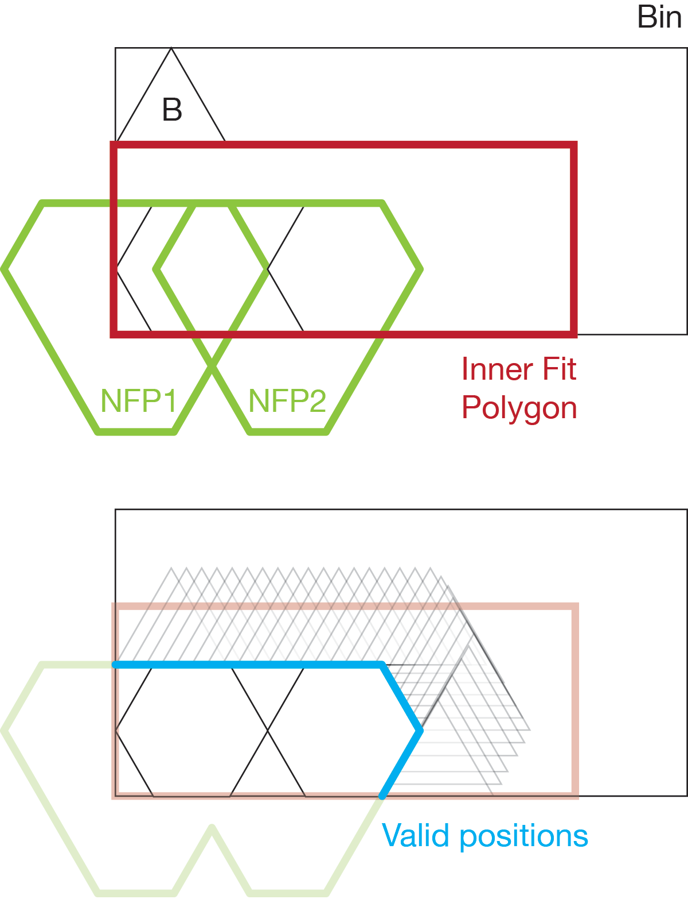

# DeepNestSharp
DeepNest - The Original (https://github.com/Jack000/Deepnest)<br />
DeepNestPort - C# port (https://github.com/fel88/DeepNestPort)

**"If I have seen further, it is by standing upon the shoulders of giants"**<br />
Jack and Felix have done some great work but the Original's use of a remote service
to translate between image formats was an issue and the Port just wasn't proving flexible/stable 
enough for my needs. I really needed the ability to save projects, nest results and 
individual sheet placements, and wanted to add the ability to seed subsequent nests with 
the results of prior nests (outstanding) and the ability to edit placements (implemented) - to 
slip that last piece in to the gaps on the sheet that the algorithm just wasn't finding.

Felix was keen to keep true to the original DeepNest code in DeepNestPort...
> > [Hope you consider breaking away from the legacy code base because it's getting really hard to merge.](https://github.com/fel88/DeepNestPort/issues/12#issuecomment-875273391)
> 
> I'll try, but it is important to keep compatibility with the original code...
> I think we shouldn't entangle our repositories too much

...so DeepNestSharp was born. It completely rebuilds the UI using WPF on Net.Core
and is a huge refactor which has paid some dividends but also introduced some 
compromises and issues, some of which are outstanding... 

DXF Import/Export: https://github.com/IxMilia/Dxf

**Project status: WIP**


On the Sheet Placement Editor you can edit the offsets or Shift+Click on parts to drag/drop in the Preview. 
FYI dragging is a little out of sync so multiple small moves work better than one large move. . . and atm
you can only move around parts already present; todo => moving from one sheet to another, adding & removing 
additional parts etc.

Individual Parts, whole Nest Result sets and single Sheet Placements can be saved, edited and reloaded. You 
can also persist and view the interim calculation objects; SheetNfp and FinalNfp - for debugging purposes.

# Outline of algorithm

While [good heuristics](http://cgi.csc.liv.ac.uk/~epa/surveyhtml.html) exist 
for the rectangular bin packing problem, in the real world we are concerned 
with irregular shapes.

The strategy is made of two parts:

- the placement strategy (ie. how do I insert each part into a bin?)
- and the optimization strategy (ie. what's the best order of insertions?)

### Placing the part

The key concept here is the "No Fit Polygon".

Given polygons A and B, we want to "orbit" B around A such that they always 
touch but do not intersect.


The resulting orbit is the NFP. The NFP contains all possible placements of B 
that touches the previously placed parts. We can then choose a point on the NFP 
as the placement position using some heuristics.

Similarly we can construct an "Inner Fit Polygon" for the part and the bin. 
This is the same as the NFP, except the orbiting polygon is inside the 
stationary one.

When two or more parts have already been placed, we can take the union of the 
NFPs of the previously placed parts.



This means that we need to compute O(nlogn) NFPs to complete the first packing. 
While there are ways to mitigate this, we take the brute-force approach which 
has good properties for the optimization algo.

## Compiling minkowski.dll
Included are a set of minkowski.dlls that work on various Windows setups I 
have; AnyCpu, x86 & x64; but you'll likely need to build the dlls for your
own setup. You can avoid the need for the C++ import altogether if you
switch off DllImport in the settings; and use the internal C# implementation
instead. Be warned that this internal implementation is not as performant as 
the C++ import atm, and it sometimes generates sub-optimal nests but it's 
an easy-start option that's proving good enough most of the time. . .

1. Replace <boost_1.76_path> with your real BOOST (1.76+) path in compile.bat

Example:
```
cl /Ox -I "D:\boost\boost_1_76_0" /LD minkowski.cc
```
2. Run compile.bat using Developer Command Prompt for Visual Studio
3. Copy minkowski.dll to MinkowskiDlls folder. If you're running in Visual Studio
DeepNestLib.CiTests has a PostBuild task to copy the DLLs from there for you. 
Otherwise make sure the appropriate DLLs get to the DeepNestSharp.exe folder. Note
there's preprocessor directives to pick the right DLL dependent on which Arch 
you're running. Works for me; YMMV.

## Contributors
* https://github.com/kelyamany/DeepNestPort (port to Net.Core)
* https://github.com/Daniel-t-1/DeepNestPort (dxf export)
* https://github.com/9swampy/DeepNestPort (simplification features)
* https://github.com/fel88/DeepNestPort (WinForms C# port)
* https://github.com/Jack000/Deepnest (The original DeepNest)
